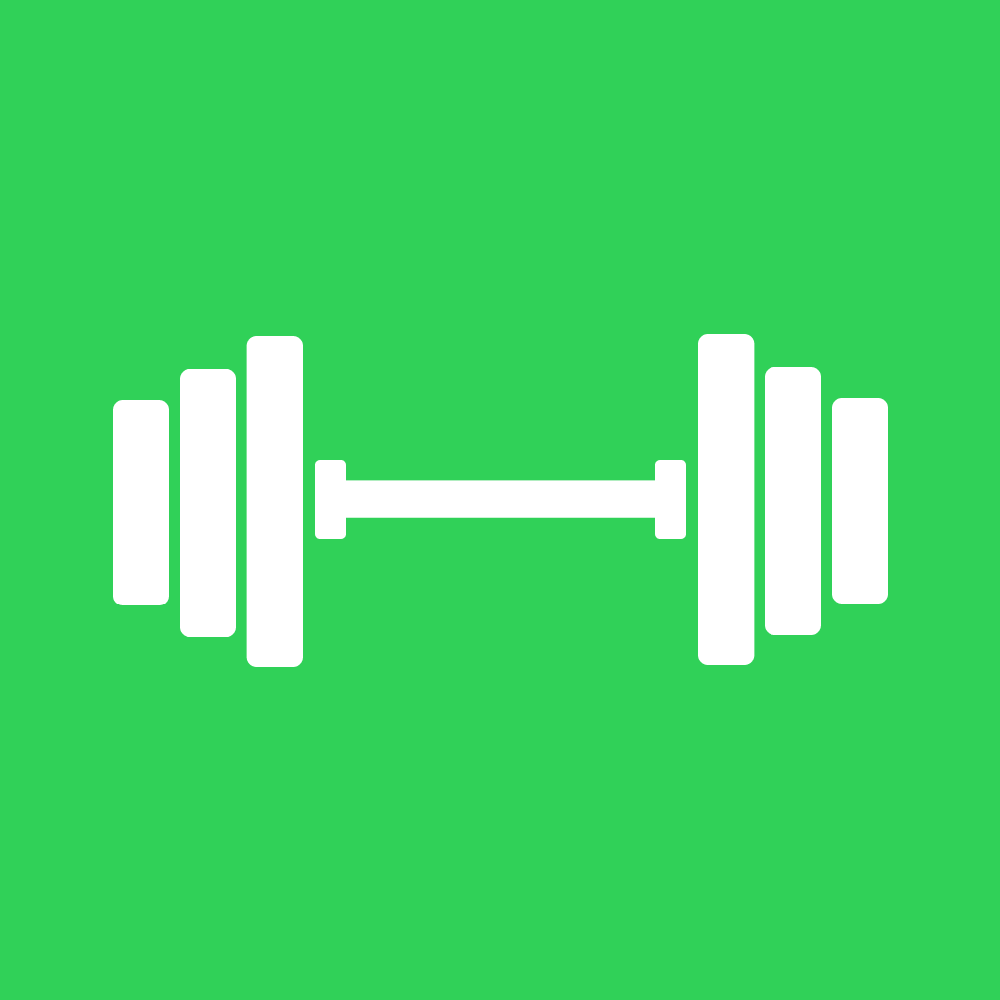
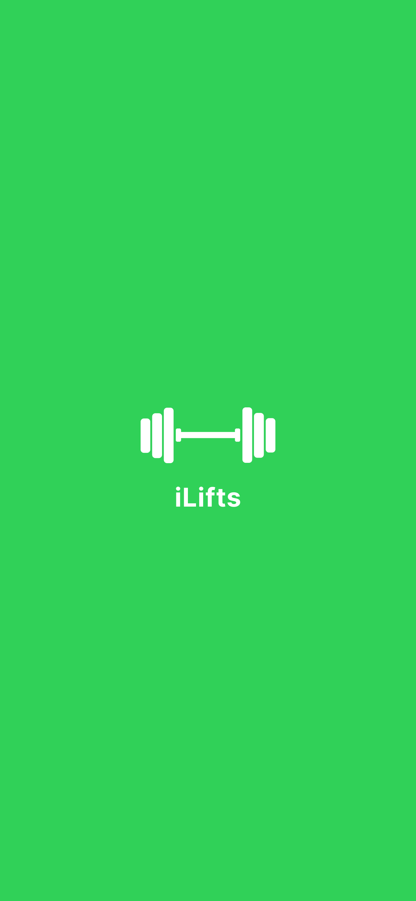
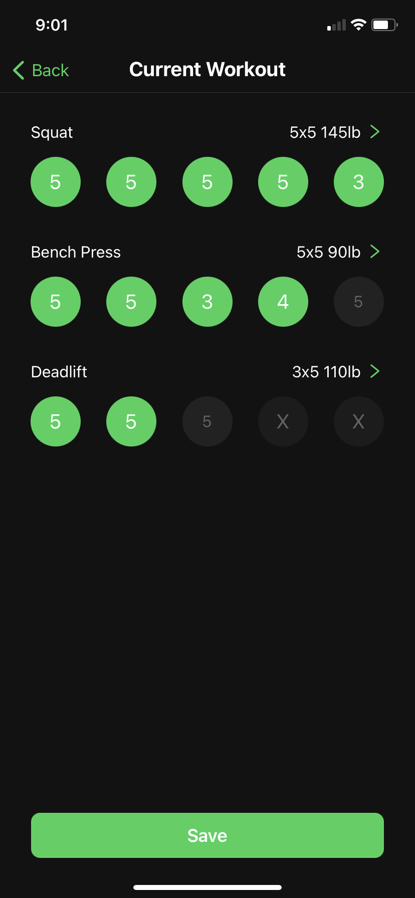
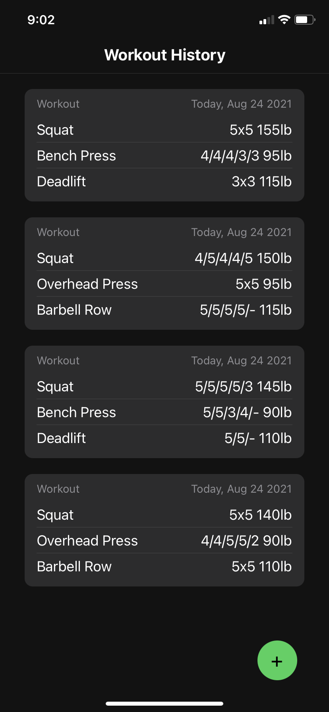
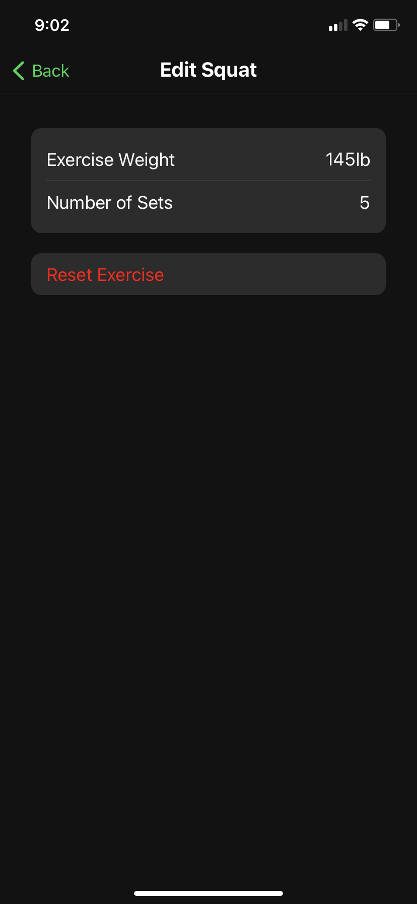
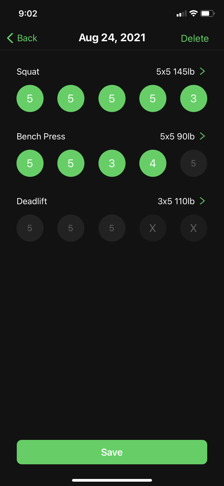

<!--
*** I'm using markdown "reference style" links for readability.
*** Reference links are enclosed in brackets [ ] instead of parentheses ( ).
*** See the bottom of this document for the declaration of the reference variables
*** for contributors-url, forks-url, etc. This is an optional, concise syntax you may use.
*** https://www.markdownguide.org/basic-syntax/#reference-style-links
-->

<!-- What my readme will consist of:
    1. Title
    2. link to website
    3. Table of Contents
    4. About the Project
        - motivation
        - technologies used
        - Design
    5. Getting started
        - prereqs
        - installation
    5. Features
    6. Usage (screenshots)
    7. Roadmap for Future
    8. License

 -->

 <!-- PROJECT LOGO -->

<br />
<p align="center">
  
  <h1 align="center">iLifts</h1>

  <p align="center">
    A mobile fitness app to track workouts and easily monitor progression!
    <br />
    <br />
  </p>
</p>

<!-- TABLE OF CONTENTS -->
<details open="open">
  <summary>Table of Contents</summary>
  <ol>
    <li>
      <a href="#about-the-project">About The Project</a>
      <ul>
        <li><a href="#motivation">Motivation</a></li>
        <li><a href="#design">Design</a></li>
        <li><a href="#built-with">Built With</a></li>
      </ul>
    </li>
    <li>
      <a href="#getting-started">Getting Started</a>
      <ul>
        <li><a href="#prerequisites">Prerequisites</a></li>
        <li><a href="#installation">Installation</a></li>
      </ul>
    </li>
    <li><a href="#features">Features</a></li>
    <li><a href="#usage">Usage</a></li>
    <li><a href="#roadmap-for-future">Roadmap For Future</a></li>
    <li><a href="#license">License</a></li>
  </ol>
</details>

<!-- ABOUT THE PROJECT -->

## About The Project

### Motivation

Fitness is a major part of my life and I particularly enjoy weightlifting. Weightlifting requires consistency and incremental progression in order to achieve physique and strength goals.

On both the Apple App store and Google store, there are little to no mobile apps that cater to tracking fitness progression without charging some sort of premium for a subscription plan. Apps that track your weight, strength progression in various exercises and give users access to personalized workout plans all require periodic payments ranging anywhere from $5-20+ per month.

My goal was to create an app with a simple, modern design that can allow users to easily log workouts and track progress weekly, monthly and even yearly for free. In addition, it was an opportunity to learn mobile development and understand the benefits of state management.

### Design

Influenced by mobile apps like Stronglifts, MyFitnessPal, SmartGym and many other fitness apps currently on the market.

### Built With

- [React Native](https://reactnative.dev/)
- [JavaScript](https://www.javascript.com/)
- [CSS](https://developer.mozilla.org/en-US/docs/Web/CSS)
- [MobX](https://mobx.js.org/README.html)
- [React Navigation](https://reactnavigation.org/)

<!-- GETTING STARTED -->

## Getting Started

To get a local copy up and running follow these simple example steps.

### Prerequisites

Need to have Node.js installed and configured on your local environment. See package.json for list of additional libraries to install.

### Installation

1. Clone the repo

   ```sh
   git clone https://github.com/usmanazz/iLifts.git
   ```

2. `cd` into the app folder.
3. Delete the package-lock.json files in the root directory.
4. Delete the node_modules folder in root directory.
5. Install NPM packages in root directory
   ```sh
   npm install
   ```
6. To run React Native project:
   ```sh
   npm start
   ```

<!-- FEATURES EXAMPLES -->

## Features

- Users can create a workout and indicate how many sets and reps were completed for a given exercise.
- A rest timer popup is displayed in between each completed set.
- Users can adjust the weight and number of sets to complete for any exercise.
- Users can reset the sets for any exercise.
- Users can save a workout.
- A list of cards representing previously saved workouts will be displayed with a date, exercises, and sets/reps completed for each exercise on the Workout History screen.
- Users can modify previous workouts as well as delete an entire workout.
- The app currently cycles between 2 default workout plans.

<!-- USAGE EXAMPLES -->

## Usage

### Screenshots

#### Splash Screen

<p align="center">
  
</p>
</br>

#### Current Workout Screen

<p align="middle">
  &nbsp;&nbsp;&nbsp;&nbsp;&nbsp;

  
</p>
</br>

#### Workout History Screen

<p align="middle">
  &nbsp;&nbsp;&nbsp;&nbsp;&nbsp;

  
</p>
</br>

#### Edit Workout Screen

<p align="middle">
  &nbsp;&nbsp;&nbsp;&nbsp;&nbsp;

  
</p>
</br>

#### Previous Workout Screen

<p align="middle">
  &nbsp;&nbsp;&nbsp;&nbsp;&nbsp;

  
</p>
</br>

<!-- ROADMAP -->

## Roadmap For Future

### Features to Add

- Add feature to track body weight every workout.
- Add notes modal to workout for users to save useful notes.
- Allow users to create their own workout plan.
- Give users option to cycle between more than 2 workout plans.
- Add more than the 5 current exercises for users to track.
- Add feature to let users customize number of sets and reps (i.e. 3x8, 4x12, 5x15).

### Fixes/Code Maintenance

- Utilize something like a Flatlist to display all previous workouts to optimize performance.
- Dim the set circle if user did not complete all the reps in a set.
- Make rest timer message dynamic.
- Animate Splash screen.
- Create a list to store various workout plans rather than hard coding it.

<!-- LICENSE -->

## License

Distributed under the MIT License. See `LICENSE` for more information.
